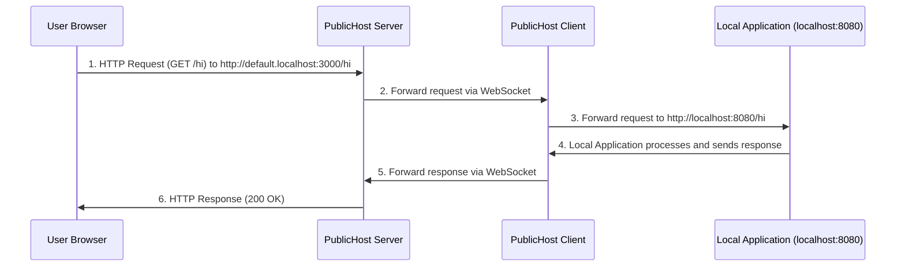

# PublicHost Server & Client

Tunneling subdomains to your localhost applications. Like [ngrok](https://ngrok.com) but open source and free.

---

> [!NOTE]  
> This is a work in progress.

---

## How it works

